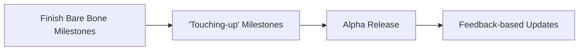

# DungeonDefender
This is a small dungeon defending game project using Solar2D. 
# What to expect?
This project is currently a work in progress. Updates are rolled out continuously as I complete certain milestones.

# Plan Going Forward

## Bare-Bone Milestones
- [x] Main Menu
	- [x] Buttons
- [ ] Game
	- [ ] Sprites
	- [ ] Player Logic
	- [ ] Creatures Logic
	- [ ] Round Logic
- [ ] Inventory Menu
	- [ ] Attach/Upgrade Items
	- [ ]  Upgrade Stats
- [ ] Shop Menu
	- [ ] Sell Items

## Extended Milestones
- [ ] Game
	- [ ] Diversify Dungeons
		- [ ] Themed Monsters
		- [ ] Themed Rewards	
	- [ ] Rewards Overhaul
- [ ] Graphics Overhaul
